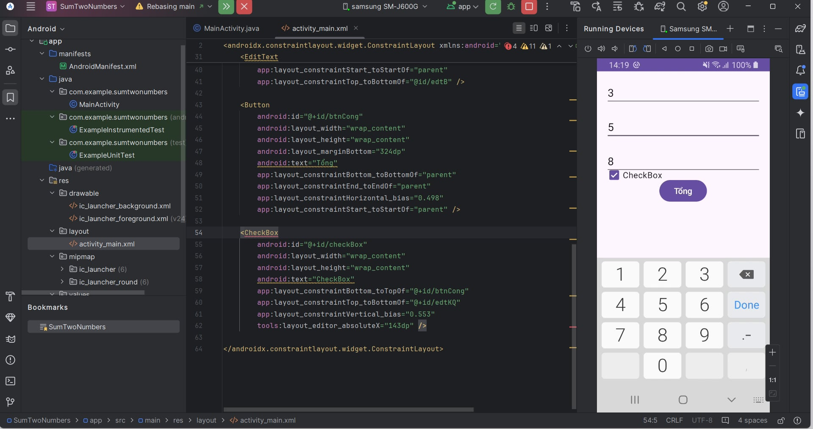
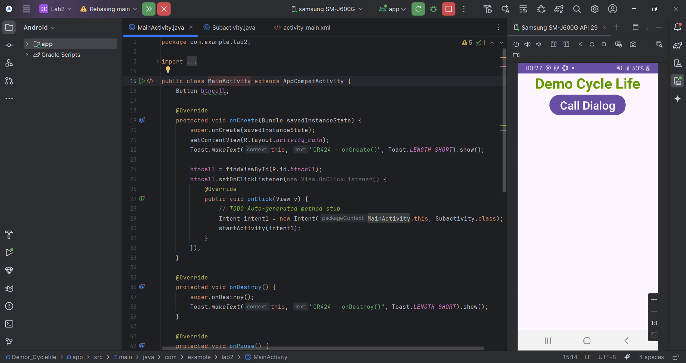
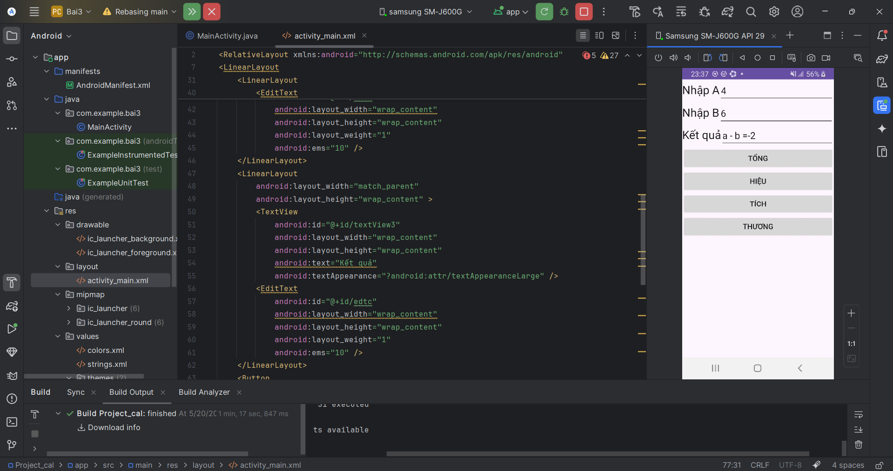

# Hướng dẫn kiểm tra bài thực hành Android

Đây là các bài thực hành Android của sinh viên **Nguyễn Tiến Bình - 2251061726 - Lớp 64CNTT3**.

## Lab 1: SumTwoNumbers

  

## Lab 2: Demor_Cyclefile
 
  

## Lab 3

  

## Các Lab tiếp theo
- Sẽ được cập nhật sau.

Vui lòng vào từng thư mục để xem chi tiết bài thực hành.-[]
